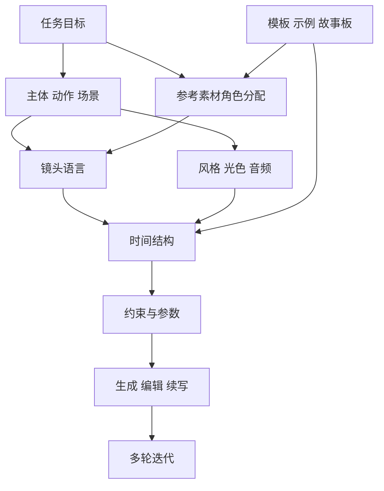

# Seedance 2.0 提示词结构与写作技巧研究报告

## 执行摘要

公开资料显示，Seedance 2.0 是由 entity["company","字节跳动","technology company"] 推出的多模态音视频生成模型，支持文本、图像、音频、视频共同作为输入，并强调参考素材、编辑、镜头与音视频联合生成能力。它和 Seed2.0 这类通用 LLM/Agent 不是同一类模型，所以对它做提示词研究，重点应放在“导演式控制”“参考素材赋权”“镜头与时间结构”，而不是把它当作纯文本问答模型来看。citeturn44view0turn1search0turn4view3turn14view0turn32search0

从官方文档、模型论文摘要、开发者博客与高质量社区案例的交叉对照看，最影响 Seedance 2.0 识别与输出稳定性的要素，依次是：参考素材的角色分配、主体/动作/场景这类核心任务描述、镜头语言与时间结构。这三类因素在高控制工作流里合计大致占到 55%–65% 的可观察影响力；风格、约束、参数属于第二梯队；传统 LLM 常说的 few-shot、角色扮演、显式 chain-of-thought，对 Seedance 2.0 直接生效的程度明显更低，通常要被改写成 storyboard、shot list 或时间轴。citeturn44view0turn4view3turn33view0turn34view0turn35view1turn35view2

这份报告给出的“权重”不是模型内部神经网络参数权重，而是“在可观察层面，某个提示要素对意图识别与输出遵循度的贡献估计”。因为官方没有公布 prompt feature coefficient，这里采用文献与案例结合的半定量方法：优先看官方显式支持的控制维度，再看跨来源共识、失败敏感度和可替代性。换句话说，它更接近产品工程中的 ablation 结论，而不是模型内部可解释性结论。citeturn44view0turn36search1turn36search0turn33view0turn35view2

还有两个很关键的现实约束。其一，关于“负向提示词”是否被 Seedance 2.0 稳定支持，社区证据并不一致：有的平台和作者认为可用，有的则明确建议改用正向 guardrails。因此，在高风险任务里，更建议写“保持什么”，再很短地补“避免什么”。其二，真实人脸、名人、IP 角色相关的内容过滤会直接干扰实验结果，导致“像是提示没理解”，其实是策略层被拒绝、降质或替换了。citeturn26search1turn26search3turn26search5turn26search11turn26search18turn43view0turn43view2

## 研究边界与资料来源

本文按官方定义，将 Seedance 2.0 视为视频生成与编辑模型，将 Seed2.0 视为通用大模型/Agent。用户问题里提到的“分类、翻译、问答、代码生成”等任务，在 Seedance 2.0 上并不属于原生职责；更合理的做法是：上游 LLM 先把这些任务产出成结构化 brief、旁白、脚本或分镜，再由 Seedance 2.0 负责把它们转成视频。citeturn44view0turn1search0

资料来源的优先顺序如下。

第一层是官方模型页、发布博文、中文/国际文档与 API 说明，主要来自 entity["company","火山引擎","cloud service"]、entity["company","BytePlus","cloud platform"] 与官方 Seed 站点。这一层用来确认模型边界、支持的输入模态、是否支持编辑/续写、任务时长与分辨率上限、资产引用方式、数字角色库与真实人物资产库等。citeturn44view0turn4view3turn32search0turn31search0turn37search0turn19search0turn43view1turn43view0

第二层是模型论文与模型卡，本文主要参考了发布时的 arXiv 摘要与模型页面摘要，用来确认“统一多模态音视频联合生成”“最长 15 秒”“支持多参考输入”“Prompt-driven camera planning”等核心能力。citeturn14view0turn44view0

第三层是平台型开发者博客，主要来自 entity["company","Higgsfield","ai platform"]、entity["company","MindStudio","automation platform"]、ChatCut、WaveSpeed 等。这些资料的价值不在“定义模型”，而在“告诉你什么写法在实战里更稳”：例如 shot structure 前置、时间轴 prompting、asset job assignment、style line、one action per beat。citeturn35view1turn34view0turn33view0turn35view2

第四层是社区案例与开源提示库，主要看 entity["company","GitHub","software platform"] 开源库、entity["company","Reddit","social media"] 测试帖与 entity["company","X","social media"] 公开实验。它们非常适合观察失败模式与工程化经验，比如“过度描述会让 motion 漂移”“移动镜头叠加移动主体更容易混乱”“长而诗性的提示常不如短而清楚的提示”。这一层可靠性低于官方，但对实操很有价值。citeturn24view1turn21view3turn30search1turn30search17turn41search18turn41search2

公开在线示例与模板入口方面，优先看官方 showcase、官方模板库/数字角色库，然后看完整 prompt library 和高质量开源库。前者用于校准模型真实能力，后者用于快速复用结构和词汇。citeturn44view0turn43view1turn35view0turn25search9turn26search17

## 提示词结构

官方与社区对 Seedance 2.0 的有效提示结构有很强的收敛：官方页面强调“director-level control”和“prompt-driven camera planning”；社区高质量资料则把它具体化为两种常见骨架，一种是“五段式”——Subject / Action / Camera / Style / Constraints，另一种是“六层式”——Input / Content / Style / Camera / Structure / Edit。两套写法本质上兼容，只是后者更贴近 Seedance 2.0 的多模态与编辑能力。citeturn44view0turn4view3turn33view1turn24view1turn24view3turn24view0turn24view2turn35view2



上图对应的是 Seedance 2.0 最常见的“先定内容与参考，再定镜头与时序，最后补 guardrails”的工作流。官方教程与第三方高质量指南都反复强调：这个模型更像在读分镜和拍摄说明，而不是在读一段自由散文。citeturn33view0turn34view0turn35view1turn37search0

下表给出各提示要素的定义、常见写法和适合 Seedance 2.0 的模板骨架。表中最后两项“参考素材角色分配”与“镜头/时间结构”虽然不在传统 LLM prompt taxonomy 里，却是 Seedance 2.0 的核心控制轴。citeturn44view0turn33view0turn24view1turn34view0turn35view2

| 要素 | 在 Seedance 2.0 里的定义 | 常见写法 | 模板骨架 |
|---|---|---|---|
| 指令/任务描述 | 说明要生成什么视频、谁在做什么、最终目标是什么 | “生成 10 秒商业短片”“做一个 3 镜头追逐场景” | `生成[时长]、[镜头数]、[画幅]的视频；主体是[谁/什么]；核心动作是[动作]。` |
| 上下文/背景 | 场景、时间、天气、品牌语境、叙事关系 | “黄昏地铁站”“清晨厨房”“奢侈品广告语境” | `场景：[地点]；时间：[晨/昏/夜]；环境细节：[光线/天气/材质/品牌背景]。` |
| 示例/演示 | 在 Seedance 中更多体现为参考图、参考视频、故事板或模板，而不是传统 few-shot 文本示例 | `@Image1 as storyboard`、模板库、角色库、镜头参考视频 | `@Image1 作为故事板/首帧参考，@Video1 作为镜头节奏参考。` |
| 约束/格式要求 | 指定必须保持的东西、镜头规则、输出组织方式 | “one-take”“no cuts”“保持人脸一致”“无字幕” | `约束：保持[人物/产品/场景]一致；镜头规则：[one-take / no cuts]；输出不得出现[字幕/抖动/品牌错误]。` |
| 风格/语气 | 在视频里更像视觉风格、布光、色调、质感、音乐气质 | “35mm film grain”“Rembrandt lighting”“clinical but warm” | `风格：[视觉锚点]；灯光：[布光]；色彩：[色调]；质感：[颗粒/锐度/景深]；音乐：[情绪/节奏]。` |
| 关键词/标签 | 压缩表达的镜头、质感、节奏、摄影术语 | `dolly in`、`rack focus`、`gimbal`、`film grain` | `关键词：[镜头术语]，[光线术语]，[材质术语]，[节奏词]。` |
| 否定提示 | 用来抑制伪影、漂移、扭曲；但跨平台支持存在不一致 | `avoid jitter`、`avoid flicker`、`no text overlay` | `优先写正向守则：保持人脸一致、自然肢体、镜头平稳；若平台支持，再补 avoid jitter / flicker。` |
| 参数/超参 | 视频时长、分辨率、画幅、shot count、Fast/Standard；公开资料里未见温度/Top-p 这类 LLM 超参 | `15s 1080p 16:9 6 shots fast` | `参数：[时长]，[分辨率]，[画幅]，[镜头数]，[模型档位]。` |
| 多轮提示设计 | 不是聊天式“上下文记忆”，更像一轮一轮锁定变量 | first pass → refine camera → extend/edit | `第 1 轮锁主体与外观；第 2 轮锁镜头和节奏；第 3 轮只改一个变量；第 4 轮用编辑/续写。` |
| 参考素材角色分配 | 给每个图/视频/音频明确“工作职责” | `@image1 as first frame`、`@video1 for camera movement` | `@Image1 作为人物外观，@Image2 作为材质/场景，@Video1 作为镜头运动，@Audio1 作为情绪与节拍。` |
| 镜头/时间结构 | 按 shot 或 timestamp 写“每一拍发生什么” | `Shot 1... Shot 2...`、`[0s] [3s] [6s]` | `[0s] 建立镜头... [3s] 缓慢 dolly in... [6s] 特写落点... 全局 style line 置于末尾。` |

官方教程建议用简洁、准确的自然语言写效果；如果对外观预期很明确，先用生图生成锚点，再做图生视频，控制通常会更强。实战资料也普遍指出，短而结构化的提示往往优于长而抒情的提示；社区测试给出的“甜点区”大约在 50–200 词之间，带参考的 I2V/R2V 通常还能更短。citeturn37search0turn41search1turn41search6turn41search18turn35view2

下面给一个适合大多数短视频场景的综合模板。

```text
3镜头，10秒，16:9，1080p。
@Image1 作为人物外观与服装参考，@Video1 作为镜头运动与节奏参考，@Audio1 作为音乐气质参考。
黄昏的地铁站里，一名穿深蓝风衣的女性从站台尽头走来，停在售票机前回头看向镜头。
镜头1：静态广角建立空间。
镜头2：缓慢 dolly in 到中景，步态自然。
镜头3：轻微 rack focus 到她的侧脸，停 1 秒。
风格：冷色霓虹、35mm 胶片颗粒、低调布光、浅景深。
约束：人物五官保持一致，镜头平稳，无字幕，动作自然。
```

这个模板吸收了官方对多模态参考、镜头规划与编辑能力的定义，也吸收了时间轴 prompting、style line、asset job assignment 这几类实战结构。citeturn44view0turn4view3turn33view0turn34view0turn35view1turn35view2

## 写作技巧与常见模式

如果只挑几种最值得投入的写法，结论很清楚：分步指令、时间轴/shot list、分层提示、导演式 brief、多轮单变量迭代，是 Seedance 2.0 最吃得开的几类结构；单纯把 prompt 写得更“文艺”，通常帮助有限。citeturn33view0turn34view0turn35view1turn35view2

| 技法/模式 | 对 Seedance 2.0 的推荐度 | 原因 | 备注 |
|---|---|---|---|
| 分步指令 | 很高 | 把复杂任务拆成一个个可执行 beat | 每个 beat 只放一个主动作和一个主镜头更稳 |
| 时间轴 prompting | 很高 | 显式控制节奏、镜头落点、动作顺序 | 5 秒用 2–3 个时间点，10 秒用 3–4 个时间点更合适 |
| 分层提示 | 很高 | 先资产、再内容、再镜头、再风格，冲突更少 | 很适合多参考 R2V 和编辑任务 |
| 导演式写法 | 高 | 模型对摄影术语、镜头术语响应更好 | 有效的是“导演 brief”，不是空泛人设 |
| 反向提示 / 正向 guardrails | 中 | 对抖动、变形、身份漂移有帮助 | 社区对 dedicated negative prompt 存在分歧 |
| 角色扮演 | 中低 | “像导演一样写”有效，“你是一名导演”本身权重不高 | 作用常来自结构，不来自 persona 咒语 |
| 文本 few-shot 示例 | 低 | Seedance 更擅长读参考素材与模板，而非 ICL 文本示例 | 可用故事板、模板库代替 |
| 显式 chain-of-thought | 低 | 对视频模型不如对文本推理模型直接有效 | 更适合改写成 shot-by-shot reasoning |

“分步指令”和“时间轴 prompting”是收益最高的一组。MindStudio 的经验总结很直接：时间戳、shot type 和 camera direction 能把“静态图像式 prompt”变成“真正的视频序列”，并且每个时间点最好只覆盖一个镜头位置、一个动作和一个氛围细节；过载单个时间点，会让模型不知道谁优先。citeturn34view0

“角色扮演”在 Seedance 2.0 上有一个很容易被误解的地方：真正有帮助的，不是开头写“你是一位奥斯卡导演”，而是把 prompt 写成导演说明、摄影指导 brief 或 shot list。官方页面用“director-level control”来定义这类能力，ChatCut 也明确说最佳 prompt 更像 direction，而不是 creative writing。citeturn44view0turn33view0

“chain-of-thought”要谨慎迁移。CoT 在文本 LLM 里对复杂推理任务确实常有明显增益，几篇经典论文和后续 survey 结论都一致；但对 Seedance 2.0 这类视频生成模型，更有效的方式是把“思路”外显成时间轴、分镜、资产分工和转场逻辑，而不是让模型输出一段隐藏或显式自我推理。也就是说，CoT 在这里通常要被翻译成 storyboard。citeturn36search2turn36search3turn36search1turn34view0

“反向提示”和“正向 guardrails”需要分开看。社区证据有明显分歧：有些指南认为 Seedance 接受 negative prompt，并能降低抖动、扭曲和漂移；另一些指南则建议尽量避免显式 negative 语法，改为强调“maintain face consistency”“steady motion”“natural limb anatomy”这类正向约束。保守做法是：先写正向一致性守则，再按平台能力酌情加一两条简短负向约束，别写成一大串 ban list。citeturn26search1turn26search3turn26search5turn26search11turn26search18

常见陷阱里，优先级最高的有六类。其一，单个 beat 里塞太多动作和镜头。其二，用“epic、beautiful、cool”这类模糊形容词代替摄影术语。其三，让移动镜头叠加移动主体，还叠加复杂背景。其四，前后用不同指代叫同一个主体，破坏角色一致性。其五，参考视频推镜头，你的文本却写 static，相互打架。其六，提示太长、修辞太多，后半段把前半段冲淡。citeturn34view0turn30search8turn30search17turn30search1turn41search2turn41search18

还有一个很实用的技巧：如果外观必须精确，比如产品细节、品牌 logo、演员妆造、固定角色脸型，中文官方教程已经明确给出方向——先生成或准备锚点图，再做图生视频或参考生视频。这条经验在产品广告、人物一致性、多镜头叙事里都很重要。citeturn37search0turn29search4turn30search13

## 影响力评估与权重估计

先说明这张表的含义：这里的“权重”指某个提示要素对 Seedance 2.0 识别用户意图、保持输出遵循度的可观察贡献估计，基线场景设为“高控制短视频工作流”，也就是 I2V / R2V 或多参考短片。它不是模型内部注意力或梯度权重。估计方法采用四项综合评分：官方显式支持度、跨来源共识强度、失败敏感度、可替代性，再归一化到 100。citeturn44view0turn4view3turn36search1turn33view0turn34view0turn35view2

| 提示要素 | 估计权重 | 置信度 | 判断依据 |
|---|---:|---|---|
| 参考素材角色分配 | 22% ± 6 | 高 | 官方明确把 image/audio/video reference 作为一等控制信号，社区反复验证“不给 asset job 就容易漂” |
| 指令/任务描述 | 18% ± 5 | 高 | 主体、动作、目标决定模型先解析什么 |
| 镜头/时间结构 | 17% ± 5 | 高 | 官方强调 prompt-driven camera planning；时间轴和 shot list 对视频连贯度极敏感 |
| 风格/语气 | 9% ± 3 | 中 | 对视觉气质影响明显，但权重常低于主体/动作/镜头 |
| 上下文/背景 | 8% ± 3 | 中 | 增强场景识别与叙事连贯，但通常服务于主体和动作 |
| 约束/格式要求 | 7% ± 3 | 中 | one-take、无字幕、一致性等能明显压低伪影与漂移 |
| 参数/超参 | 7% ± 3 | 中 | 时长、分辨率、画幅、shot count 影响生成边界；公开文档未见温度类 LLM 参数 |
| 关键词/标签 | 4% ± 2 | 中低 | 当关键词是摄影术语时很有用；当只是审美形容词时帮助有限 |
| 多轮提示设计 | 3% ± 2 | 中 | 对单次识别权重不高，但对项目成功率很关键 |
| 示例/演示 | 3% ± 2 | 低 | 文本 few-shot 边际收益小；转成故事板/参考素材后会并入更高权重要素 |
| 否定提示 | 2% ± 2 | 低 | 社区意见分裂；只建议短而精确地使用 |

这张表最值得关注的信号有三个。第一，Seedance 2.0 的最高权重要素不是“修辞水平”，而是“参考素材和结构化控制”。第二，摄像机与时序在这里和主体/动作几乎同级，因为它本质上就是视频模型。第三，style 确实重要，但它更影响“像什么”，不如前几项那样决定“到底做没做对”。citeturn44view0turn33view0turn34view0turn35view2

如果从任务类型再细分，权重会明显移动。纯 T2V 没有参考素材时，“参考素材角色分配”这一列会下降到接近 0，而任务描述、镜头结构、风格与上下文会整体上升；I2V/R2V 则恰好相反，参考素材常常会跃升到 25%–35%。编辑/续写任务里，最重要的往往是“改什么”和“什么不能变”，因此 edit intent 与 preserve constants 的权重会提高。音频驱动的广告或口播任务里，音频参考与节拍的比重也会变大。citeturn32search0turn33view0turn35view1turn43view1

传统 LLM prompt 元素为什么分数低？原因很简单：Seedance 2.0 的主战场不是文本推理。few-shot、CoT、persona 这些模式在文本模型上很有效，这是文献共识；但放到 Seedance 2.0 里，它们真正有效的部分，通常已经转译成了参考图、参考视频、镜头表、时间轴、故事板和编辑指令。也就是说，Seedance 的“示例”更像 asset 与 template，不太像 prompt 里的 input-output demo。citeturn40search0turn36search2turn36search3turn36search1turn43view1

关于否定提示，这里保持保守。若平台文档或界面明确支持 negative field，可以在最后补极短的故障约束；若没有明确支持，优先写正向一致性守则。因为跨平台包装层、内容过滤层和资产管理层都会影响“负向提示是否看起来生效”。citeturn26search1turn26search5turn26search11turn43view2

## 可复现实验设计

如果目标是把上面的估计权重做成可复现结论，建议采用“分任务、分条件、分重复”的 ablation 设计。任务至少分四族：T2V、I2V、R2V、多轮编辑/续写；每族准备 12–30 条概念 brief，覆盖人物叙事、产品广告、环境镜头、带音频短片四类题材。这样既能测通用规律，也能测任务偏差。

实验单位建议采用“同一概念 brief 的多个提示版本”，而不是完全不同的 prompt。基线版使用完整 prompt；ablation 版依次删除或弱化单一要素，例如删掉参考素材角色分配、删掉时间结构、把摄影术语改成模糊形容词、删掉全局 style line、把正向 guardrails 改成无约束版本。每个条件独立生成 3 次，若平台不暴露 seed，就把 3 次看作随机重复。对于支持多候选输出的平台，尽量固定为每请求 1 条，减少选择偏差和成本噪音。citeturn43view1

控制变量要尽量严。模型版本固定为同一 endpoint；分辨率、时长、画幅、shot count 固定；R2V 与 I2V 的参考素材组保持完全一致；测试时间做 block randomization，避免高峰期服务波动把结果搅乱。若任务涉及真人素材，优先走官方真实人物资产库授权链路；若不具备授权，全部换成数字角色或非人像素材，否则内容安全层会变成最大的混杂因素。citeturn19search0turn43view0turn43view1turn43view2

评价指标建议拆成“遵循度”“稳定性”“可用性”三组。遵循度包括主体准确率、动作准确率、镜头准确率、风格准确率、音频/节拍准确率；稳定性包括人物一致性、产品细节保持、抖动/闪烁/形变率；可用性包括内容过滤通过率、是否需要二次后期、人工可用评分。人工评价最好用 3 名以上盲评员做 5 分量表和成对比较；自动指标可加入视频-文本对齐评分、授权真人任务中的 face embedding 方差、产品任务中的 logo/文本保真度检测。

统计分析方面，比较适合用 mixed-effects model：把提示要素当固定效应，把概念 brief 与评审员当随机效应。若采用 Likert 分数，可以用 ordinal mixed model；若采用 pairwise 胜负，可以用 Bradley–Terry 或 Elo 式聚合。最终把标准化回归系数按任务族归一到 100，就能得到比本报告更接近“实验事实”的权重表。预算有限时，最低可做 12 briefs × 4 任务族 × 8 个 ablation 条件 × 3 次重复，共 1152 条生成；预算宽裕时，可扩到 30 briefs/族，统计会更扎实。

实验报告里还应单独记录“政策失败”与“质量失败”。前者是被安全层拦截、替换或降质；后者才是模型真正没理解 prompt。两者混在一起，会把负向提示、真人素材、名人/IP 相关任务的权重估计搞偏。citeturn43view2turn43view0

## 优化建议与任务模板

先把任务边界说清楚：Seedance 2.0 原生适合视频生成、图生视频、参考驱动视频、编辑、续写、音视频联合生成。分类、翻译、问答、代码生成本身更适合由 Seed2.0 或其他 LLM 完成；Seedance 2.0 适合把这些结果“视频化”。这也是为什么很多“LLM prompt 技巧”搬到 Seedance 上时，需要先改写成分镜、镜头和素材分工。citeturn44view0turn1search0

原生视频任务里，有四条经验最实用。第一，主体保持单一，尤其在短片里，2 个以上主体会明显增加注意力分裂。第二，一镜头只给一个主相机动作，快动作越多，形变风险越高。第三，产品广告、细节保真和角色一致性任务，优先把参考图做扎实。第四，先用 Fast 档打草稿，再按稳定版本上最终质量档，通常更省。citeturn35view2turn30search1turn29search4turn41search4

适合 Seedance 2.0 原生任务的模板如下。

```text
【文生视频叙事模板】
4镜头，12秒，16:9。
主体：一名穿卡其色风衣的女性侦探。
动作：她走进旧书店，停下，抬头，看向二楼栏杆。
场景：雨夜，暖黄钨丝灯，木质书架，空气里有轻微灰尘。
镜头1：广角建立空间，静态。
镜头2：slow dolly in 到中景。
镜头3：她抬头时切到轻微低机位近景。
镜头4：rack focus 到二楼栏杆阴影处。
风格：35mm 胶片颗粒，低调布光，暖黄高光与冷蓝阴影。
约束：动作自然，人物外观保持一致，无字幕。
```

```text
【图生视频 / 多参考模板】
@Image1 作为人物脸部与发型参考，@Image2 作为服装与材质参考，@Image3 作为场景与色彩参考，@Video1 作为相机运动与节奏参考。
10秒，3镜头，16:9。
角色从门外走入房间，在窗边停下，抬手拨开窗帘。
镜头1：沿用 @Video1 的进入节奏，广角到中景。
镜头2：窗边中景停留 2 秒。
镜头3：侧脸近景，浅景深。
风格：清晨自然光，低饱和，柔和反差。
约束：保持 @Image1 的五官，保持 @Image2 的服装细节，动作松弛平稳。
```

```text
【时间轴 / 商业广告模板】
3镜头，8秒，1:1。
@Image1 作为产品正面参考，@Image2 作为材质与 logo 细节参考。
[0s] 极近景：产品置于石材台面，背光，边缘高光清晰。
[2s] 慢速 pull back：出现完整产品与一支绿色枝条，背景虚化。
[5s] 右向左 arc shot：慢速环绕，展示玻璃/金属/皮革质感。
全局风格：商业摄影质感，干净阴影，微暖白平衡，高锐度。
约束：logo 不变形，无文字叠加，镜头平稳，产品居中。
```

```text
【编辑 / 续写模板】
对 @Video1 续写 4 秒。
保持原有人物外观、服装、灯光、镜头高度与场景不变。
新增内容：人物停步后转身，轻声说一句话，再看向窗外。
镜头：保持中景，缓慢 push in。
音频：沿用原视频情绪，加入轻微环境雨声。
约束：嘴型与语气自然，人物五官一致，无额外角色进入画面。
```

这些模板的骨架来自官方对多模态输入、编辑能力和相机控制的定义，也参考了平台实践里对 shot structure、asset assignment、style line 与 timeline prompting 的共识。citeturn44view0turn32search0turn33view0turn34view0turn35view1turn35view2

如果用户真正想做的是“分类、翻译、问答、代码生成”，建议按下表把任务转换成适合 Seedance 的视频任务。

| 原任务 | Seedance 是否原生适配 | 推荐工作流 | 可直接用的 Seedance 模板思路 |
|---|---|---|---|
| 分类 | 否 | 上游 LLM 输出类别与理由 → 下游做结果展示视频 | “信息卡 + 类别高亮 + 旁白总结 + 相关 B-roll” |
| 翻译 | 否/部分 | 上游 LLM 翻译文本 → TTS/旁白 → 下游生成口播或字幕视频 | “双语字幕、口型、情绪一致的讲解视频” |
| 问答 | 否/部分 | 上游 LLM 输出答案与结构 → 下游生成 FAQ 讲解片段 | “问题出现 → 回答分三拍呈现 → 结尾 CTA/收束镜头” |
| 代码生成 | 否 | 上游 LLM 产出代码与 demo 脚本 → 下游生成产品演示和开发者 explainer | “终端 / UI / 成果展示 + 旁白 + 节奏化镜头” |
| 创意生成/广告/叙事视频 | 是 | 直接 T2V / I2V / R2V / 编辑 / 续写 | 采用本节四类原生模板 |

对于这些“非原生文本任务”，更合理的模板是“让上游模型先把内容压缩成视频 brief”。下面给出四个转换模板。

```text
【分类结果可视化】
输入给 Seedance 前，先准备：
- 类别：A
- 关键依据：……
- 置信度：……

Seedance 提示：
6秒，16:9。
生成一个结果展示短片：画面先展示待分类对象，再高亮类别 A 的视觉符号，最后用信息卡呈现关键依据。
风格：简洁、专业、低杂讯。
约束：信息层次清晰，无多余装饰，无字幕遮挡主体。
```

```text
【翻译内容视频化】
输入给 Seedance 前，先准备：
- 原文
- 译文
- 旁白文本
- 语气说明

Seedance 提示：
8秒，9:16。
@Audio1 作为旁白语气参考。
生成一段双语讲解视频：人物面对镜头说出台词，字幕先显示译文，末尾闪现原文关键词。
风格：自然口播、镜头平稳、近景。
约束：嘴型自然，字幕不遮脸，情绪与旁白一致。
```

```text
【问答解释视频】
输入给 Seedance 前，先准备：
- 问题
- 三段式答案
- 每段对应的画面建议

Seedance 提示：
10秒，3镜头。
镜头1展示问题场景。
镜头2用具体例子解释答案核心。
镜头3总结并停在结论画面。
风格：解释型短视频，节奏清楚，镜头简洁。
约束：一镜头只讲一个点，避免同时出现多个新信息。
```

```text
【代码生成结果演示】
输入给 Seedance 前，先准备：
- 功能说明
- UI/终端截图
- 关键交互步骤
- 旁白文案

Seedance 提示：
12秒，4镜头。
@Image1 作为产品主界面参考，@Image2 作为代码片段视觉参考。
镜头1展示需求。
镜头2展示界面加载。
镜头3展示关键交互。
镜头4展示结果与收益。
风格：开发者产品演示，干净、清楚、屏幕内容稳定。
约束：界面元素不漂移，文字区域保持可读，镜头不要过度晃动。
```

如果任务涉及真实人像，一般不要只靠 prompt 反复描述“长得像某人”。官方文档已经给出更稳的路径：有授权时走真实人物资产库；无授权时优先用数字角色库或平台虚拟角色。对于长期项目，这样做不只是合规，也能显著提高一致性和生产效率。citeturn43view0turn43view1

## 参考来源

**官方模型、发布与接口文档**

- Seedance 2.0 官方模型页（模型定位、多模态输入、导演级控制、内部基准）citeturn44view0
- Seedance 2.0 Official Launch（发布博文，含 Prompt-driven camera planning、参考驱动案例）citeturn4view3turn4view5
- Seedance 2.0 模型卡 / arXiv 摘要（统一多模态音视频联合生成、15 秒时长、输入上限）citeturn14view0
- Doubao Seedance 2.0 系列提示词指南 / BytePlus Prompt Guide（T2V / I2V / R2V / 编辑能力说明）citeturn32search0turn9search1
- Doubao Seedance 2.0 系列教程 / SDK 教程（自然语言写法、图生视频优先建议）citeturn31search0turn37search0
- 视频生成任务 API 说明（时长、分辨率、输入素材数量等任务参数）citeturn19search0
- Digital character library（数字角色库、模板库、`@Image` 引用、代码样例）citeturn43view1
- Add real-human assets to asset library（真实人物授权资产库）citeturn43view0

**通用 prompt engineering 文献**

- *A Systematic Survey of Prompt Engineering Techniques*（prompt taxonomy，含其他模态技巧）citeturn36search1turn36search5
- *A Systematic Survey of Prompt Engineering in Large Language Models*（prompt engineering 总览）citeturn36search0
- *Language Models are Few-Shot Learners*（few-shot prompting 的经典来源）citeturn40search0
- *Chain-of-Thought Prompting Elicits Reasoning in Large Language Models*（CoT 对文本推理任务的作用）citeturn36search2
- *Large Language Models are Zero-Shot Reasoners*（Zero-shot CoT）citeturn36search3

**开发者博客与平台实践**

- ChatCut《Seedance 2.0 Prompt Guide: How to Create Better AI Videos》（asset job assignment、音频/编辑实践）citeturn33view0
- Higgsfield《Seedance 2.0 — Complete Prompting Guide》（shot structure、duration、aspect ratio 前置）citeturn35view1turn35view0
- MindStudio《How to Use Timeline Prompting with Seedance 2.0 for Cinematic AI Video》（时间轴 prompting、style line、常见错误）citeturn34view0
- MindStudio《What Is the Seedance 2.0 Content Restriction Problem?》（全球版 face/IP 过滤与混杂因素）citeturn43view2
- WaveSpeed《Seedance 2.0 Prompt Template》（subject → action → camera → style → constraints）citeturn35view2
- WaveSpeed《Best Settings Guide》（参数扫表与单变量测试思路）citeturn41search16turn30search19

**社区示例、开源提示库与实测**

- GitHub 开源库《The Seedance 2.0 Prompt Library》（Input / Content / Style / Camera / Structure / Edit 六层）citeturn21view3turn23view3turn24view0turn24view1turn24view2turn24view3
- GitHub 开源库《awesome-seedance-2-prompts》与《awesome-seedance-2-guide》citeturn25search9turn26search17
- Reddit 实测《I tested 50+ Seedance 2.0 prompts…》（静态镜头、物理灯光、慢动作描述）citeturn30search1turn29search9
- Medium / 社区经验《How to Keep Character Consistency in Seedance 2.0》（文本描述与参考图的权衡）citeturn30search2
- Atlas Cloud《Guide to All-Round Reference》（身份参考与运动参考的取舍）citeturn29search0turn29search4
- 近期平台化 Prompt Collections（70+ / 500+ / 15 tested prompts）citeturn33view2turn39search6turn41search13